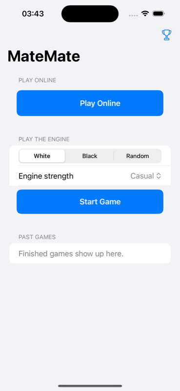

<p align="center">
  
</p>

<h1 align="center">MateMate</h1>

<p align="center">
  Play chess on your iPhone — against a built-in engine, or live against other people.<br>
  100% Swift: SwiftUI app, hand-written engine, Vapor multiplayer server.
</p>

<p align="center">
  <a href="https://github.com/testtest126/chess/actions/workflows/ci.yml"></a>
  <a href="LICENSE"></a>
</p>

---

<p align="center">
  
</p>

## What you can do

- ♟️ **Play the engine** — four strengths from Beginner to Expert, driven by a
  negamax search with a transposition table, quiescence, and an opening book.
  Get hints, take moves back, drag or tap pieces.
- 🌍 **Play people online** — 5+3 blitz with matchmaking, server-enforced
  clocks, draw offers, Elo ratings, and a leaderboard. No sign-up: a guest
  account is created for you on first play and lives in your Keychain.
- 📈 **Review every game** — engine analysis of each move (best → blunder),
  accuracy scores, an evaluation graph, "best was …" suggestions, and full
  board playback. Works for engine and online games alike.

## Try it in two minutes

All you need is a Mac with **Xcode 15+** (iOS 17 SDK).

```sh
git clone https://github.com/testtest126/chess.git
cd chess
open ios-chess-client/ios-chess-client.xcodeproj
```

Press **Run** (⌘R), pick a color and an engine strength, and play. Hints,
takebacks, and post-game review all work offline — no server needed.

### Want online play too?

Start the server, then launch the app in **two** simulators and tap
*Play Online* in both — they'll be matched against each other:

```sh
swift run --package-path chess-server App serve --hostname 127.0.0.1 --port 8080
```

Debug builds of the app connect to `127.0.0.1:8080` automatically. For a real
deployment (Postgres, JWT secret, Docker, TLS) see the
[server README](chess-server/README.md).

## How it's put together

| Directory | What it is |
| --- | --- |
| [`ChessKit/`](ChessKit) | Swift package, three libraries: **ChessKit** (board, legal moves, SAN/FEN/PGN, game state, review), **ChessProtocol** (engine, opening book, UCI adapter), **ChessOnline** (wire protocol shared by app & server) |
| [`ios-chess-client/`](ios-chess-client) | SwiftUI app (iOS 17+) |
| [`chess-server/`](chess-server) | Vapor backend: guest auth, matchmaking, realtime games over WebSockets, clocks, Elo, history |

Three design decisions worth knowing:

- **The server is authoritative.** Clients mirror the game locally for
  highlights and SAN, but every online move is legality-checked server-side
  with ChessKit before it's broadcast; clocks and results are enforced there
  too.
- **One wire protocol, compiled twice.** The `ChessOnline` target is the
  single source of truth for client/server messages — no JSON drift.
- **The engine is deterministic** (fixed-seed hashing, no randomness unless
  an opening book is attached), which makes search behavior testable down to
  exact node counts.

## Tests

```sh
swift test --package-path ChessKit        # rules, engine, protocol (60 tests)
swift test --package-path chess-server    # auth + WebSocket match integration
```

CI runs both suites on every PR. The app's UI test suite includes a true
end-to-end online match: the test process registers its own account, queues
over a WebSocket, and plays engine moves against the app in the simulator.

## Contributing

New here? Issues tagged
[`good first issue`](https://github.com/testtest126/chess/issues?q=is%3Aissue+is%3Aopen+label%3A%22good+first+issue%22)
are picked to be approachable. See [CONTRIBUTING.md](CONTRIBUTING.md) for
setup and ground rules.

## License

[MIT](LICENSE)
